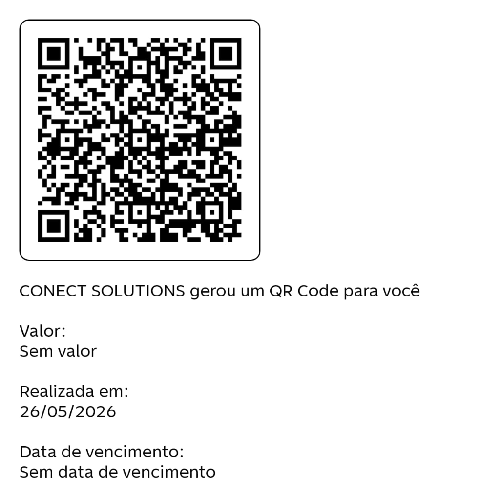

# Connect Desk 🖥️✨

> 🌐 **Language / Idioma:** [🇧🇷 Português](#connect-desk-%EF%B8%8F-1) | [🇺🇸 English](#connect-desk-%EF%B8%8F-english-version)

O **Connect Desk** é um software de suporte e controle remoto de alto desempenho baseado em tecnologias modernas de web e APIs nativas do Windows. Ele permite que você visualize e controle computadores remotamente em tempo real diretamente pelo seu navegador, sem a necessidade de instalar clientes pesados no lado do visualizador.

Com um design premium de última geração — utilizando dark mode, glassmorphism e efeitos fluidos —, o Connect Desk combina facilidade de uso com excelente performance.

---

## 🚀 Funcionalidades Principais

- **Captura Ultra-Rápida de Tela:** Motor de captura nativo escrito em C# e executado dinamicamente via PowerShell em segundo plano (GDI+), garantindo alta taxa de quadros e excelente nitidez para leitura de textos.
- **Controle Interativo Completo:** 
  - **Mouse:** Movimentação, cliques (esquerdo e direito) e rolagem (*scroll*).
  - **Teclado:** Envio de texto e teclas especiais (Enter, Backspace, Tab, Setas direcionais, Delete, etc.).
- **Painel de Controle Web Responsivo:** Interface web incrível baseada em fontes modernas (Outfit e Inter) com controle dinâmico de zoom/escala ("Ajustar à tela" ou "1:1 Real").
- **Conectividade Segura por Sessão:** Cada máquina de destino recebe um endereço exclusivo de 9 dígitos formatado e uma senha temporária aleatória de 4 dígitos gerada a cada inicialização do cliente.
- **Servidor Web Coordenador Embutido:** O próprio cliente consegue inicializar um painel web local na porta `4500` caso esteja em rede local, permitindo controle direto.
- **Empacotamento Standalone:** O cliente pode ser compilado em um único arquivo executável `.exe` de clique único usando a ferramenta `pkg`.
- **Solução Inteligente para VPS Windows:** Integração nativa de instruções e alertas para evitar o travamento de tela/tela preta comum ao minimizar ou desconectar sessões RDP em servidores virtuais.

---

## 🛠️ Arquitetura do Projeto

O projeto é dividido em duas partes principais:

1. **`server/` (Servidor Coordenador):**
   - Baseado em **Node.js**, **Express** e **Socket.io**.
   - Atua como um intermediário leve e de baixa latência que apenas redireciona os comandos de mouse/teclado dos visualizadores para a máquina alvo, e redistribui os frames de vídeo da máquina alvo para os visualizadores.
   
2. **`client/` (Cliente Host / Máquina Alvo):**
   - Um aplicativo **Node.js** que inicia um processo persistente e otimizado do PowerShell.
   - O script do PowerShell carrega dinamicamente código C# nativo para interagir diretamente com as APIs do Windows (GDI+, `user32.dll` para movimentos de mouse e teclado).
   - Envia os frames de tela como JPEG comprimido em qualidade de alta fidelidade via conexões de WebSocket (Socket.io).

---

## 📋 Pré-requisitos

* **Servidor Coordenador:** Qualquer sistema operacional (Windows, Linux, macOS) com **Node.js v16+** instalado.
* **Cliente (Máquina a ser controlada):** Sistema Operacional **Windows** (devido ao uso de APIs nativas Win32 e GDI+) com **Node.js v16+** instalado.
* **Visualizador (Viewer):** Qualquer dispositivo moderno com um navegador web atualizado (Chrome, Edge, Firefox, Safari).

---

## ⚙️ Instalação e Execução

### Passo 1: Instalação das Dependências

Primeiramente, baixe ou extraia o projeto. No terminal do diretório raiz, instale as dependências gerais do projeto e do servidor:

```bash
npm install
```

Em seguida, navegue até a pasta `client/` e instale as dependências específicas do cliente remoto:

```bash
cd client
npm install
cd ..
```

---

### Passo 2: Inicializar o Servidor Coordenador

Inicie o servidor de conexão para que as máquinas possam se registrar e se comunicar. Por padrão, ele escutará na porta `4500`:

```bash
node server/server.js
```

Você verá a seguinte saída no terminal:
> `Server (Controller) running at http://localhost:4500`

*Nota: Se você for implantar o servidor em uma VPS ou nuvem, certifique-se de expor a porta `4500` (ou a porta configurada na variável de ambiente `PORT`) em seu firewall.*

---

### Passo 3: Configurar e Inicializar o Cliente

No computador que você deseja controlar:

1. Verifique as configurações no arquivo `client/config.json`:
   ```json
   {
     "id": "411988342",
     "serverUrl": "http://localhost:4500"
   }
   ```
   *Substitua `http://localhost:4500` pelo IP público ou domínio do seu servidor coordenador, se ele não estiver rodando localmente.*

2. Inicialize o cliente:
   ```bash
   node client/client.js
   ```

3. O console do cliente limpará a tela e exibirá as credenciais de conexão seguras formatadas:

   ```text
   ==================================================
         CONNECT DESK REMOTE CONTROL CLIENT (PoC)    
   ==================================================
     Endereço Remoto:      123 456 789
     Senha Temporária:     4321
   ==================================================
     Conectando ao Coordenador: http://localhost:4500
   ==================================================
     ► SE DETECTAR TELA PRETA EM VPS WINDOWS:
       Caso sua sessão RDP caia ou seja fechada, a GUI trava.
       Para desconectar mantendo a tela ativa, rode no cmd:
       tscon 1 /dest:console (troque 1 pelo ID da query session)
   ==================================================
     ► PARA CONTROLAR OUTRO COMPUTADOR:
       Pressione [Enter] para abrir o Painel de Controle
   ==================================================
   ```

---

### Passo 4: Realizar o Controle Remoto

1. No computador do suporte (Visualizador), abra o navegador e acesse o endereço do servidor coordenador (ex: `http://localhost:4500` ou o endereço IP público/domínio da sua VPS).
2. Na belíssima tela inicial do **Connect Desk**, insira o **Endereço Remoto** de 9 dígitos exibido no console do cliente.
3. Clique em **Iniciar Conexão**.
4. Uma janela pop-up estilizada solicitará a senha. Digite a **Senha Temporária** de 4 dígitos gerada no console da máquina alvo e clique em **Confirmar**.
5. **Pronto!** A tela da máquina remota será renderizada de forma ultra fluida. Use o mouse e o teclado para operá-la como se estivesse na frente dela.

---

## 📦 Compilando para Executável Standalone (`.exe`)

Para facilitar o uso por parte de clientes ou usuários de suporte final, você pode compilar o módulo `client` em um único arquivo executável para Windows. Isso elimina a necessidade de instalar o Node.js na máquina que será controlada!

Para fazer isso:
1. Abra um terminal na pasta `client/`:
   ```bash
   cd client
   ```
2. Execute o comando de compilação:
   ```bash
   npm run build
   ```
3. A ferramenta `pkg` irá empacotar todos os scripts, dependências do node_modules e arquivos estáticos da pasta `public` no executável.
4. O arquivo gerado estará disponível em `client/dist/connectdesk.exe`.

Agora você pode enviar este arquivo diretamente para o usuário. Ele só precisa dar um duplo clique no executável para gerar as credenciais de suporte instantâneo!

---

## 💡 Dica Especial para VPS Windows (GUI Inativa / Tela Preta)

Ao utilizar o controle remoto em VPSs Windows (como as contratadas na AWS, Azure, Google Cloud ou provedores locais), é comum se deparar com uma tela preta se você fechar ou minimizar a janela de Conexão de Área de Trabalho Remota (RDP) padrão do Windows. Isso ocorre porque o Windows desativa o renderizador GUI de tela ativa para economizar recursos quando não há nenhum usuário RDP ativo.

Para solucionar isso e manter a tela ativa para o **Connect Desk** continuar funcionando perfeitamente, siga estas etapas antes de fechar o seu RDP:

1. Abra o **Prompt de Comando (CMD)** como **Administrador** na sua VPS.
2. Execute o seguinte comando para obter o ID da sua sessão RDP ativa:
   ```cmd
   query session
   ```
3. Você verá uma lista. Procure pela linha com o nome do seu usuário (normalmente `Administrator` ou `Administrador`) sob a sessão com nome ativo `rdp-tcp#...` e anote o número exibido na coluna **ID** (geralmente é `1` ou `2`).
4. Execute o comando a seguir substituindo o `ID_DA_SESSAO` pelo número anotado:
   ```cmd
   tscon ID_DA_SESSAO /dest:console
   ```
   *Exemplo:* `tscon 1 /dest:console`
5. A sua janela do RDP padrão será fechada imediatamente. Porém, o Windows irá transferir a interface gráfica ativa diretamente para o console local, mantendo a GUI em execução ativa.
6. Agora, o **Connect Desk** poderá transmitir a tela e aceitar comandos de mouse e teclado sem nenhum travamento ou tela preta!

---

## 🎨 Design Premium e Personalização

O Connect Desk foi desenvolvido sob os mais rígidos padrões de design moderno para proporcionar a melhor experiência do usuário:
- **Tipografia Fluida:** Utilização das fontes Outfit e Inter via Google Fonts.
- **Aparência Premium Glass:** Efeitos de desfoque de fundo (*backdrop-filter*) e gradientes elegantes que acompanham as interações.
- **Responsividade Dinâmica:** O visualizador é compatível tanto com monitores ultrawide quanto com notebooks e telas menores, graças à capacidade inteligente de ajuste e redimensionamento automático do canvas.

---

## 💖 Contribuição e Doações

Se este projeto foi útil para você ou se você deseja apoiar o desenvolvimento contínuo do **Connect Desk**, sinta-se à vontade para fazer uma doação de qualquer valor! 

Toda contribuição é extremamente bem-vinda e nos ajuda a manter o projeto ativo, aprimorando funcionalidades e trazendo novas atualizações.

<p align="center">
  
  <br>
  <strong>Escaneie o QR Code acima para doar qualquer valor via Pix 🚀</strong>
</p>

---

## 💬 Suporte e Comunidade

Para esclarecer dúvidas, reportar problemas ou interagir com outros desenvolvedores e usuários do **Connect Desk**, participe do nosso grupo oficial no WhatsApp:

👉 [**Acessar Grupo de Suporte no WhatsApp**](https://chat.whatsapp.com/FTE2GEq7m4BAKaR42wttSi)

---

## 📄 Licença

Este projeto é desenvolvido para fins educacionais e de demonstração de conceito (PoC). Sinta-se livre para customizar, expandir e integrar em suas próprias soluções de suporte de TI!

---

<br>

---

# Connect Desk 🖥️✨ — English Version

> 🌐 **Language / Idioma:** [🇧🇷 Português](#connect-desk-%EF%B8%8F) | [🇺🇸 English](#connect-desk-%EF%B8%8F-english-version)

**Connect Desk** is a high-performance remote support and control software built on modern web technologies and native Windows APIs. It allows you to view and control computers remotely in real time, directly from your browser — no heavy client installation required on the viewer's side.

With a cutting-edge premium design — featuring dark mode, glassmorphism, and fluid effects — Connect Desk combines ease of use with excellent performance.

---

## 🚀 Key Features

- **Ultra-Fast Screen Capture:** Native capture engine written in C# and executed dynamically via PowerShell in the background (GDI+), ensuring high frame rates and excellent sharpness for text readability.
- **Full Interactive Control:**
  - **Mouse:** Movement, clicks (left and right), and scroll wheel.
  - **Keyboard:** Text input and special keys (Enter, Backspace, Tab, Arrow keys, Delete, etc.).
- **Responsive Web Control Panel:** An amazing web interface using modern fonts (Outfit and Inter) with dynamic zoom/scale control ("Fit to Screen" or "1:1 Real Size").
- **Secure Session Connectivity:** Each target machine receives a unique 9-digit formatted address and a random 4-digit temporary password generated at every client startup.
- **Built-in Coordinator Web Server:** The client itself can initialize a local web panel on port `4500` when on a local network, enabling direct control.
- **Standalone Packaging:** The client can be compiled into a single click-to-run `.exe` executable using the `pkg` tool.
- **Smart Solution for Windows VPS:** Native instructions and alerts integrated to avoid the black screen/screen freeze commonly encountered when minimizing or disconnecting RDP sessions on virtual servers.

---

## 🛠️ Project Architecture

The project is divided into two main parts:

1. **`server/` (Coordinator Server):**
   - Built with **Node.js**, **Express**, and **Socket.io**.
   - Acts as a lightweight, low-latency intermediary that only forwards mouse/keyboard commands from viewers to the target machine, and redistributes video frames from the target machine to viewers.

2. **`client/` (Host Client / Target Machine):**
   - A **Node.js** application that starts a persistent and optimized PowerShell process.
   - The PowerShell script dynamically loads native C# code to interact directly with Windows APIs (GDI+, `user32.dll` for mouse and keyboard input).
   - Sends screen frames as compressed JPEG in high-fidelity quality via WebSocket connections (Socket.io).

---

## 📋 Prerequisites

* **Coordinator Server:** Any operating system (Windows, Linux, macOS) with **Node.js v16+** installed.
* **Client (Machine to be controlled):** **Windows** OS (due to native Win32 and GDI+ API usage) with **Node.js v16+** installed.
* **Viewer:** Any modern device with an up-to-date web browser (Chrome, Edge, Firefox, Safari).

---

## ⚙️ Installation and Setup

### Step 1: Install Dependencies

First, download or extract the project. In a terminal at the root directory, install the general project and server dependencies:

```bash
npm install
```

Then, navigate to the `client/` folder and install the remote client's specific dependencies:

```bash
cd client
npm install
cd ..
```

---

### Step 2: Start the Coordinator Server

Start the connection server so machines can register and communicate. By default, it will listen on port `4500`:

```bash
node server/server.js
```

You will see the following output in the terminal:
> `Server (Controller) running at http://localhost:4500`

*Note: If you are deploying the server on a VPS or cloud environment, make sure to expose port `4500` (or the port configured in the `PORT` environment variable) in your firewall.*

---

### Step 3: Configure and Start the Client

On the computer you want to control:

1. Check the settings in the `client/config.json` file:
   ```json
   {
     "id": "411988342",
     "serverUrl": "http://localhost:4500"
   }
   ```
   *Replace `http://localhost:4500` with the public IP or domain of your coordinator server if it is not running locally.*

2. Start the client:
   ```bash
   node client/client.js
   ```

3. The client console will clear the screen and display the formatted secure connection credentials:

   ```text
   ==================================================
         CONNECT DESK REMOTE CONTROL CLIENT (PoC)    
   ==================================================
     Remote Address:       123 456 789
     Temporary Password:   4321
   ==================================================
     Connecting to Coordinator: http://localhost:4500
   ==================================================
     ► IF YOU DETECT BLACK SCREEN ON WINDOWS VPS:
       If your RDP session drops or is closed, the GUI freezes.
       To disconnect while keeping the screen active, run in cmd:
       tscon 1 /dest:console (replace 1 with your session ID)
   ==================================================
     ► TO CONTROL ANOTHER COMPUTER:
       Press [Enter] to open the Control Panel
   ==================================================
   ```

---

### Step 4: Performing Remote Control

1. On the support computer (Viewer), open your browser and go to the coordinator server address (e.g., `http://localhost:4500` or the public IP/domain of your VPS).
2. On the stunning **Connect Desk** home screen, enter the 9-digit **Remote Address** displayed in the client console.
3. Click **Start Connection**.
4. A stylized pop-up window will prompt for the password. Enter the 4-digit **Temporary Password** generated in the target machine's console and click **Confirm**.
5. **Done!** The remote machine's screen will render in an ultra-smooth flow. Use your mouse and keyboard to operate it as if you were sitting right in front of it.

---

## 📦 Compiling to a Standalone Executable (`.exe`)

To make it easier for end clients or support users, you can compile the `client` module into a single executable file for Windows. This eliminates the need to install Node.js on the machine to be controlled!

To do this:
1. Open a terminal in the `client/` folder:
   ```bash
   cd client
   ```
2. Run the build command:
   ```bash
   npm run build
   ```
3. The `pkg` tool will package all scripts, node_modules dependencies, and static files from the `public` folder into the executable.
4. The generated file will be available at `client/dist/connectdesk.exe`.

You can now send this file directly to the user. They only need to double-click the executable to generate instant support credentials!

---

## 💡 Special Tip for Windows VPS (Inactive GUI / Black Screen)

When using remote control on Windows VPS instances (such as those hosted on AWS, Azure, Google Cloud, or local providers), it is common to encounter a black screen if you close or minimize the standard Windows Remote Desktop Connection (RDP) window. This happens because Windows disables the active screen GUI renderer to save resources when no RDP user is active.

To fix this and keep the screen active so **Connect Desk** continues working perfectly, follow these steps before closing your RDP session:

1. Open **Command Prompt (CMD)** as **Administrator** on your VPS.
2. Run the following command to get your active RDP session ID:
   ```cmd
   query session
   ```
3. You will see a list. Look for the line with your username (usually `Administrator`) under the active session named `rdp-tcp#...` and note the number in the **ID** column (usually `1` or `2`).
4. Run the following command, replacing `SESSION_ID` with the noted number:
   ```cmd
   tscon SESSION_ID /dest:console
   ```
   *Example:* `tscon 1 /dest:console`
5. Your standard RDP window will close immediately. However, Windows will transfer the active graphical interface directly to the local console, keeping the GUI running.
6. Now, **Connect Desk** can transmit the screen and accept mouse and keyboard commands without any freezing or black screen!

---

## 🎨 Premium Design and Customization

Connect Desk was developed under the strictest modern design standards to provide the best user experience:
- **Fluid Typography:** Uses the Outfit and Inter fonts via Google Fonts.
- **Premium Glass Appearance:** Background blur effects (*backdrop-filter*) and elegant gradients that respond to interactions.
- **Dynamic Responsiveness:** The viewer is compatible with ultrawide monitors as well as laptops and smaller screens, thanks to intelligent automatic canvas scaling and resizing.

---

## 💖 Contributing and Donations

If this project has been useful to you or if you would like to support the continued development of **Connect Desk**, feel free to make a donation of any amount!

Every contribution is extremely welcome and helps us keep the project active, improving features and bringing new updates.

<p align="center">
  
  <br>
  <strong>Scan the QR Code above to donate any amount via Pix 🚀</strong>
</p>

paypal for donations https://www.paypal.com/invoice/p/#WQJU2VBBSCU7QP6H

---

## 💬 Support and Community

To get help, report issues, or interact with other **Connect Desk** developers and users, join our official WhatsApp group:

👉 [**Join the Support Group on WhatsApp**](https://chat.whatsapp.com/FTE2GEq7m4BAKaR42wttSi)

---

## 📄 License

This project is developed for educational and proof-of-concept (PoC) purposes. Feel free to customize, expand, and integrate it into your own IT support solutions!
